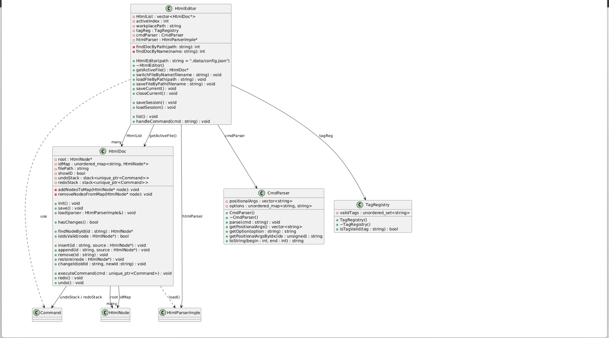
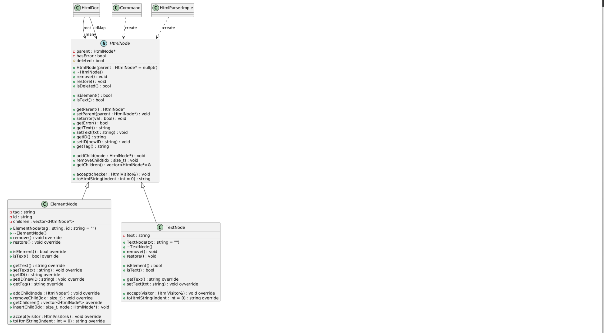
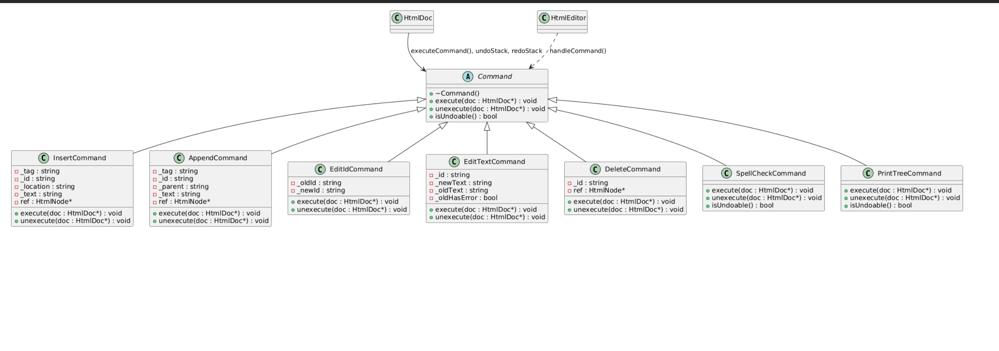
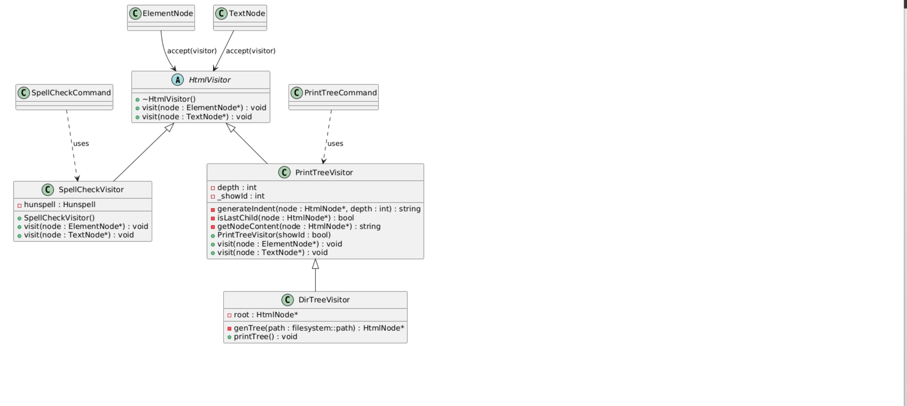
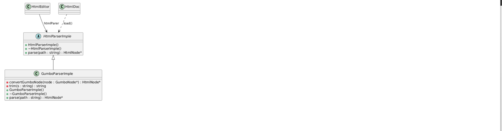

# OOT PJ1 命令行Html编辑器
姓名：李增昊， 学号：22307130108
> 项目的编译运行方式请见报告最后

> 请阅读[这个部分](#特别提醒)了解editor在IO操作上的基本逻辑

## 架构描述和依赖关系
### 模块功能描述
这一段我将对本HtmlEditor中的几个重要模块的功能简单概括：

#### HtmlEditor.h
Editor 是整个系统的入口和协调者，**相当于所谓的session**，负责管理多个 HTML 文档（HtmlDoc），和用户交互，并维持当前 session 的状态（如打开的文件列表、当前活动文件、是否显示节点 ID 等）。

此外，Editor 还负责 session 的保存与恢复，使编辑器具备持久化能力。它不直接处理文档结构，而是将操作委托给其他模块。

#### HtmlDoc.h
HtmlDoc 表示一个 HTML 文件在内存中的表示，它内部维护了一棵以 HtmlNode 为节点的 DOM 树结构，还通过维护ID映射表以加快对节点的访问。

该模块对外提供诸如加载、保存、打印、设置显示选项等接口，并作为命令（Command）执行的接收者（Receiver）。

在项目中，HtmlDoc 是具体**文件级**操作的核心，负责组织节点树并允许 visitor 对其进行访问。

#### HtmlNode.h
HtmlNode 是 HTML 树的基本构成单元。它本身是composition设计模式的一个例子：
- HtmlNode为基类，它抽象出了通用的接口
- ElementNode 表示 HTML 标签节点，支持子节点；
- TextNode 表示文本节点，不支持子节点。
通过这样的设计模式，节点的访问者可以不考虑节点类型而统一地 对待/操作 它们。

节点之间组成一棵树形结构，支持添加子节点、设置 ID、标记拼写错误等操作。

它们还提供了统一的 accept 接口，允许外部的 Visitor 对其结构进行遍历与处理。

#### Visitor.h
Visitor 是对 DOM 树结构的一种操作方式，遵循访问者模式（Visitor Pattern）。

通过实现不同的 Visitor 子类（如 SpellCheckerVisitor, TreePrintVisitor），可以在不修改 Node 类的前提下，对节点执行多种功能。

访问者从根节点递归遍历整棵树，适用于需要对结构进行分析或展示的命令。

#### Command.h
Command 模块封装了用户的编辑操作，遵循命令模式（Command Pattern）。我使用这个模式，是希望用 简洁，统一 的方式支持undo/redo操作。

同时，它也简化了`HtmlEditor.h`的职责：Editor可以只负责创建Command实例并交付给Receiver--HtmlDoc，而不用使用HtmlDoc的接口，也不用保存状态。

每个命令对象包含了执行逻辑和必要的上下文信息。绝大多数情况下，HtmlEditor创建它们，HtmlDoc通过UndoStack和RedoStack管理它们。

部分命令（如拼写检查）会使用 Visitor 处理节点树，部分命令则直接调用 HtmlDoc 的接口。

#### HtmlParserImple.h
这个模块管理 html解析 的下层细节，它本身是 Bridge 设计模式的例子。

它将‘功能’和‘具体实现’解耦。在这个PJ中，我依靠的是Google早些年研发的Gumbo进行html解析。倘若在不同平台上，需要使用别的解析器，就只需要再从HtmlParserImple中派生一个子类即可。

#### CmdParser.h
该模块对用户输入的命令做解析。
它将命令解析为positional arguments和options。方便Editor使用。


### 模块依赖关系
以下是最顶层的Editor和Doc：

与之相关的HtmlNode：

Command：

不同的Visitor：

HtmlParserImple：


### 解释
**Command**：通常情况下，由HtmlEditor创建它们。不过由于undo/redo是份文件单独管理的，所以具体的undo/redo stack在HtmlDoc中管理

**HtmlParser**：HtmlEditor管理一个指向具体实例的指针。在HtmlDoc需要进行load/read操作时，把这个实例当作参数传递。这样做有两个好处：1. 方便确定一个全局的解析器，供所有html文档使用。 2. 避免在每个htmlDoc中维护parser的实例或是共享指针，parser的生命周期由editor统一管理。

**HtmlNode**：作为composition模式的基类，它将一些不是所有子类都支持的操作设置为“报错”。比如作为leaf的TextNode不能操作子节点，它从HtmlNode继承下来的这些操作就会报错。而具备此能力的ElementNode需要覆写这些操作。


## 项目运行方式

注意：我全程只在windows系统上测试过代码，我无法保证这个项目在Mac系统上一定可以正常工作。
**注意**：提交文件路径中包含“学号_姓名”，有中文字符，可能导致安装失败。这时请尝试把HtmlEditor文件夹放到没有中文字符的路径下。

该项目由纯c++编写。请保证你的编译器支持c++17或以上。

该项目中依赖一些外部库，它们通过vcpkg管理。具体已经在vcpkg.json中注明。如果安装顺利，你将不用管这些外部库是什么。

### 安装vcpkg
你需要拥有vcpkg来运行该项目。假如你已经安装过vcpkg，请直接看下一部分。

进入项目文件夹：
```shell
>cd path/to/HtmlEditor
```

安装vcpkg：
```shell
path/to/HtmlEditor> git clone https://github.com/microsoft/vcpkg.git
path/to/HtmlEditor> cd vcpkg
path/to/HtmlEditor/vcpkg> .\bootstrap-vcpkg.bat 
```
请注意，vcpkg默认使用微软Visual Studio的cl.exe作为编译器。

### 安装依赖
如果你没有vcpkg，或是愿意安装上面的步骤局部配置vcpkg，那么直接执行下面的操作：
```shell
path/to/HtmlEditor/vcpkg> cd ..
path/to/HtmlEditor> .\vcpkg\vcpkg.exe install 
```
此时HtmlEditor下应该会出现一个`vcpkg_installed`目录。之后运行：
```shell
path/to/HtmlEditor> cmake -B build -S .
path/to/HtmlEditor> cmake --build build
```
没有报错说明安装成功。

---

假如你已经有vcpkg，那么，你需要在上面的命令中使用你的vcpkg路径：
```shell
path/to/HtmlEditor> path/to/vcpkg/vcpkg.exe install
```
此时HtmlEditor下应该会出现一个`vcpkg_installed`目录。最后运行：
```shell
path/to/HtmlEditor> cmake -B build -S .
path/to/HtmlEditor> cmake --build build
```

### 运行代码
#### 测试
>！！！不要修改tests目录下的内容

测试代码包括以下几个部分：
- testCmdParser
- test_parser (parser for html file)
- test_spellChecker
- test_node
- test_htmlDoc
- test_printTree
- test_editor

可以通过
```shell
path/to/HtmlEditor> .\build\test\test_xxx.exe
```

分别运行测试。或者通过下面这个批处理文件一起运行：

```shell
path/to/vcpkg> .\run_tests.bat
```
我的测试代码写得比较简约，用了很多assert。中途没有弹窗报错，意味着测试通过。

#### 运行editor

使用HtmlEditor，请运行以下命令，或是直接到对应目录下双击.exe文件：
```shell
path/to/HtmlEditor> .\build\release\HtmlEditor.exe
```
在我的提交文件中，已经包含一个保存的session，它会导致编辑器打开`HtmlEditor/data/foo.html`。如果你不喜欢的话，可以删除data目录下下`config.json`，这样会打开一个空的编辑器。

### 特别提醒
由于实验文档在read, save filepath, load, save filename等几个命令的实现要求上，表述得并不清晰，这里我需要对我的实现做出说明：
#### 关于save
不添加任何参数的情况下，保存当前文件
```shell
path/to/HtmlEditor> save
# save the current file
```
参数为文件名时，保存打开文件中，名字匹配的文件
```shell
path/to/HtmlEditor> save foo.html
# search in opened files and save the corresponding one
```
参数为文件路径时，尝试将当前文件另存为参数所示的文件，会要求用户确认
```shell
path/to/HtmlEditor> save ./bar/foo_2.html
# save current file as './bar/foo_2.html', prompt to comfirm this action
```

#### 关于load & read & init
在多文件编辑的场景下，可以有多个打开的文件

load会加载一个新文件，而read将当前文件的内容替换为你指定的内容。两个动作都无法undo。read在执行之前会向用户确认。
```shell
path/to/HtmlEditor> load ./data/foo.html
# create a new htmlDoc with the content of `./data/foo.html`
path/to/HtmlEditor> read ./data/bar.html
# replace current htmlDoc's content 
```
load一个不存在的文件，会导致一个包含原始内容的文件被创建，而init会将当前文件的内容替换为原始内容。
换句话说：当你想要创建一个新的原始文件，使用load + 不存在的文件路径；当你想要放弃目前编辑的内容，将文件初始化，使用init。
```shell
path/to/HtmlEditor> load ./not/exist.html
# create a new htmlDoc and init it with default content
path/to/HtmlEditor> init
# replace current htmlDoc's content with the default content
```